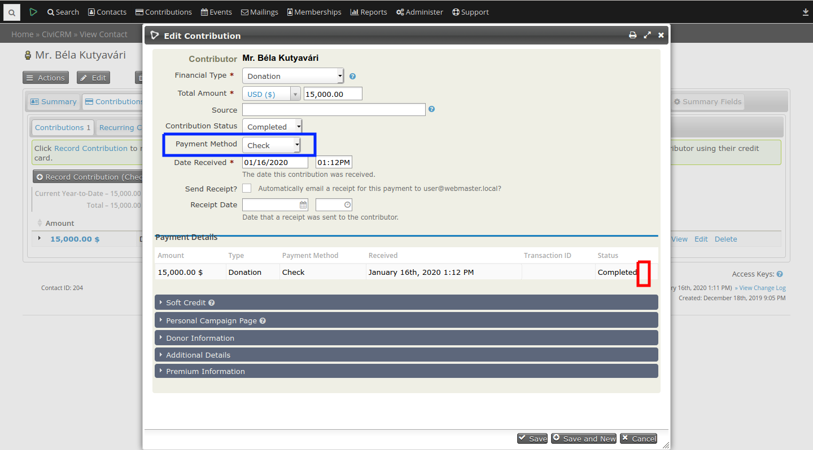

# hu.es-progress.change-payment-method



This extension adds the option to change a contributions payment method
on the edit contribution form.

Also removes the action button to edit payment details. This is to eliminate confusion.

The extension is licensed under [AGPL-3.0](LICENSE.txt).

## Requirements

* PHP v7.0+
* CiviCRM (5.0) might work in earlier versions, not tested

## Installation (Web UI)

This extension has not yet been published for installation via the web UI.

## Installation (CLI, Zip)

Sysadmins and developers may download the `.zip` file for this extension and
install it with the command-line tool [cv](https://github.com/civicrm/cv).

```bash
cd <extension-dir>
cv dl hu.es-progress.change-payment-method@https://github.com/sandorsemsey/hu.es-progress.change-payment-method/archive/master.zip
```

## Installation (CLI, Git)

Sysadmins and developers may clone the [Git](https://en.wikipedia.org/wiki/Git) repo for this extension and
install it with the command-line tool [cv](https://github.com/civicrm/cv).

```bash
git clone https://github.com/sandorsemsey/hu.es-progress.change-payment-method.git
cv en change_payment_method
```

## Usage

On the edit contribution form you can find the new field

## Known Issues

Removing of payment details edit action button is not optional, it will happen anyway.
